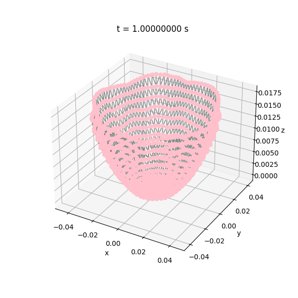
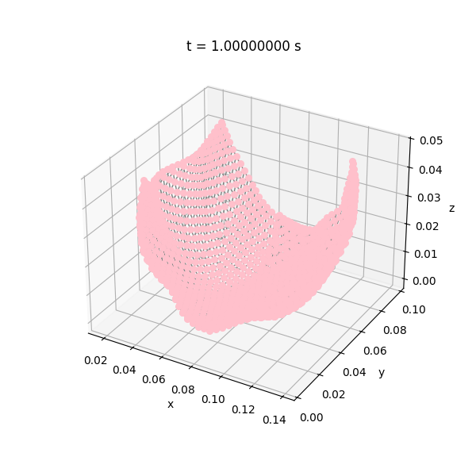
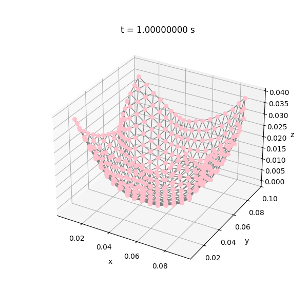
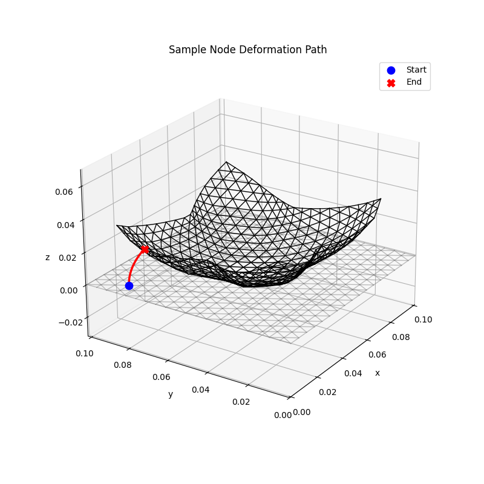
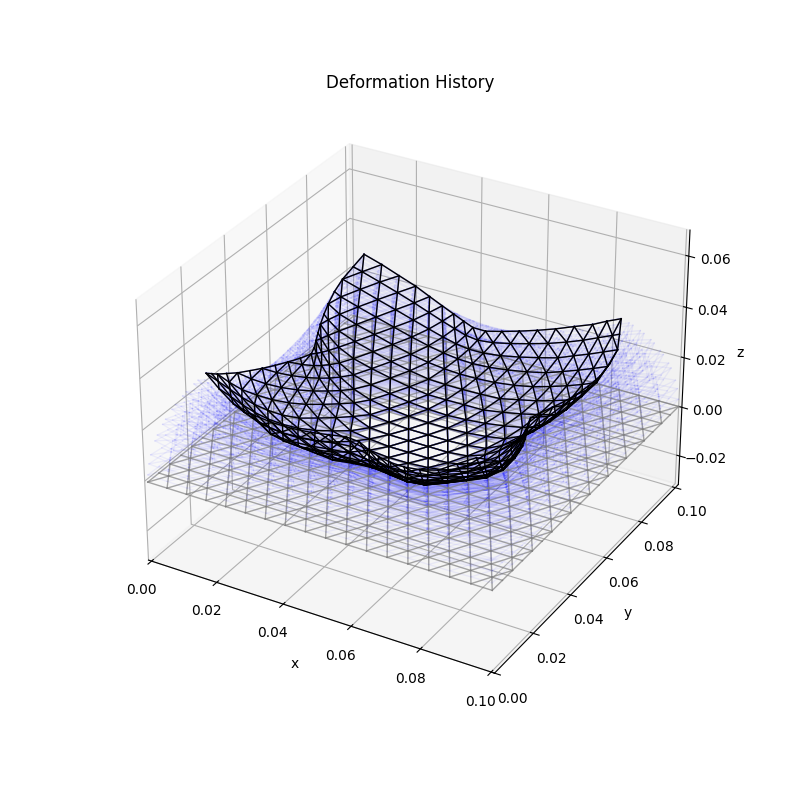

# ThermalDES: A Coupled Thermo-Mechanical Simulator for Patterned Bilayers

**ThermalDES** is a Python-based physical simulator for elastic plates and shells that morph into 3D shapes via thermal actuation.

This simulator models the coupled stretching, bending, and thermal effects in patterned, multi-material (bilayer) composites.
It is designed to accurately predict the complex 3D equilibrium shapes that result from 2D fabrication, accounting for material properties, thermal strain patterns, and external forces like gravity.

## Dependencies

The simulation requires the following Python libraries:

* `numpy`
* `matplotlib`
* `scipy` (specifically `scipy.io` for saving `.mat` files)

The script also depends on the local `src.ThermalDES` library.

## Usage

After installing the dependencies, you can run the simulation from the command line.

```
python main.py
```

This is the default run, with no custom parameters set. Custom parameters can be initialized as arguments on the command line as follows:

```
--mesh <int>:          Specifies which mesh file to load (Default: 1). 
--eps-thermal <float>: Sets the target thermal strain coefficient (Default: -0.3). 
--gravity <0 or 1>:    Toggles gravity (0 = no gravity, 1 = gravity on) (Default: 1). 
--fluctuate <0 or 1>:  Toggles thermal strain fluctuations on the boundary (0 = no, 1 = yes) (Default: 0). 
--print:               Enables detailed print statements during the simulation. 
--plot:                Enables generating and showing plots. 
--test:                Runs the built-in validation tests.
```

For example, to run the simulation for mesh 2 with a thermal strain of -0.5, with gravity disabled and plotting enabled, run the following:

```
python main.py --mesh 2 --eps-thermal -0.5 --gravity 0 --plot
```

The project structure which details which files and folders the key components are in can be found in `organization.txt`

## Simulation Workflow
The main script executes a two-phase simulation:

### Initialization:

Parses all command-line arguments.

Loads the specified mesh file (X0_4columns, ConnectivityMatrix_line, Triangles).

Calculates material properties (e.g., ks12, kb12) based on the bilayer parameters (h1, h2, Ysoft, Yhard).

### Patterning:

Defines a spatial pattern (e.g., whole_peanut_region, circle_six_arms_region) based on the chosen mesh.

Assigns spatially-varying Young's modulus (Y_array) and thermal actuation strain (eps_th_vector) to the mesh edges based on this pattern.

Generates ks_array (stretching stiffness) and kb_array (bending stiffness) from the material properties.

### Model Assembly:

Performs a topological analysis to identify all "hinge edges" (interior edges) and assembles them into HingeQuads_order.

Instantiates the ElasticGHEdgesCoupledThermal model, which combines stretching, bending, and thermal energy terms.

### Phase 1: Thermal Actuation (with Gravity):

A static simulation runs from t=0 to t=totalTime.

In each step, the thermal strain is gradually ramped up: eps_th = eps_th_vector * (t / totalTime).

Boundary conditions are applied (e.g., holding the center nodes fixed).

A static Newton solver (timeStepper3D_static) finds the new equilibrium shape q_new under the influence of both thermal strain and gravity (if iGravity == 1).

The simulation uses adaptive time-stepping to ensure convergence.

The full deformation history (q_full_history) is recorded.

#### Save 1:

After Phase 1 completes, the full simulation state (with gravity and thermal strain) is saved to: output/output_deps_thermal_WithGravity.mat

### Phase 2: Gravity Relaxation:

A second, short simulation begins.

The thermal strain is held constant at its maximum value.

Over relax_steps, the gravity vector g_vec is linearly ramped down to zero.

The solver finds the new equilibrium at each step, allowing the structure to "relax" into its purely thermally-actuated shape.

#### Save 2:

The final, relaxed, gravity-free state is saved to: data/output_deps_thermal_NoG.mat

Final Visualization:

A 3D plot is generated showing the entire deformation path (from both phases) for a randomly selected node.

## Sample Visualizations

Here are some sample results from the simulation, located in the `figures/` directory.

### Final Actuated Shapes

Shows the final equilibrium shapes for three different initial mesh patterns.

<table>
  <tr>
    <td></td>
    <td></td>
    <td></td>
  </tr>
</table>

---

### Deformation Path

These images illustrate the transformation process.

**Node Path:** Shows the initial (flat) and final (actuated) states for Mesh 3, highlighting the full 3D path taken by a single node during the simulation.


**Transition States:** Shows the overlaid intermediate shapes, illustrating the gradual transition from the 2D pattern to the 3D structure.


## Future Contributions

Potential areas for future development of **ThermalDES** include:

* **Machine Learning Integration:**
    * Developing **Physics-Informed Neural Networks (PINNs)** to solve the governing PDEs or create fast surrogate models.
    * Using **Neural ODEs** (Ordinary Differential Equations) to learn the system's dynamics or deformation paths from data, potentially accelerating the solver.
* **Performance Optimization:**
    * Parallelizing the solver and assembly routines (e.g., using `numba` or GPU acceleration via `cupy`).
    * Integrating more advanced or robust non-linear solvers.
* **GUI & Visualization:** Developing a simple graphical user interface (GUI) for setting up simulations, defining patterns, and interacting with the 3D results in real-time.
* **Expanded Test Suite:** Adding more validation cases against experimental data or other simulation software (like Abaqus or ANSYS) to further benchmark accuracy.